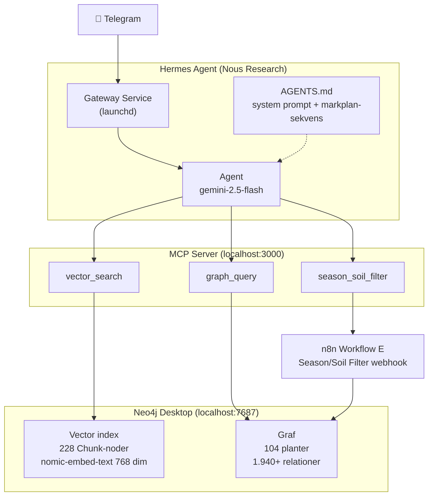
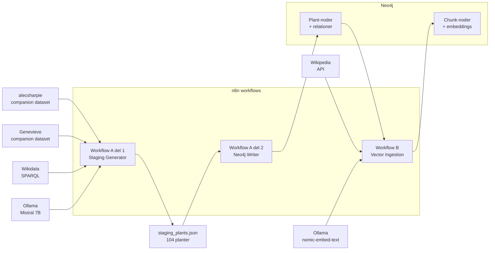
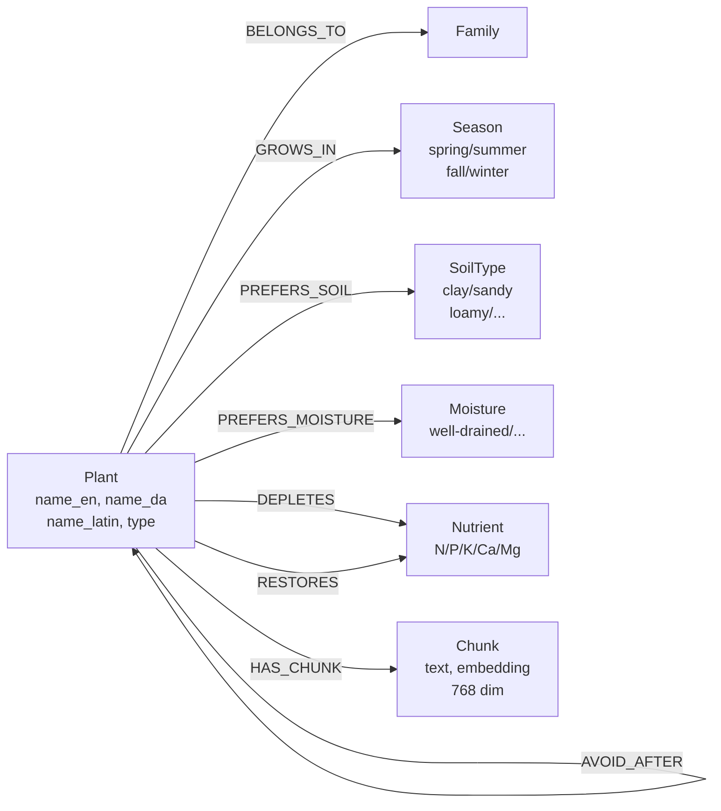

# Arkitektur — PlotPlanner RAG

## Systemarkitektur (runtime)

---

## Data-pipeline (ingestion)

---

## Neo4j datamodel

---

## MCP tool-strategi

| Spørgsmål | Tool | Eksempel |
|-----------|------|---------|
| Specifik plante | `graph_query` | "hvad trives godt med tomater?" |
| Åbent dyrkningsspørgsmål | `vector_search` | "hvad kræver kål af jordbund?" |
| Hvad kan jeg plante | `season_soil_filter` | "hvad egner sig til lerjord om foråret?" |
| Markplan | Alle tre i sekvens | `season_soil_filter` → `graph_query` × 3-5 → `vector_search` |
